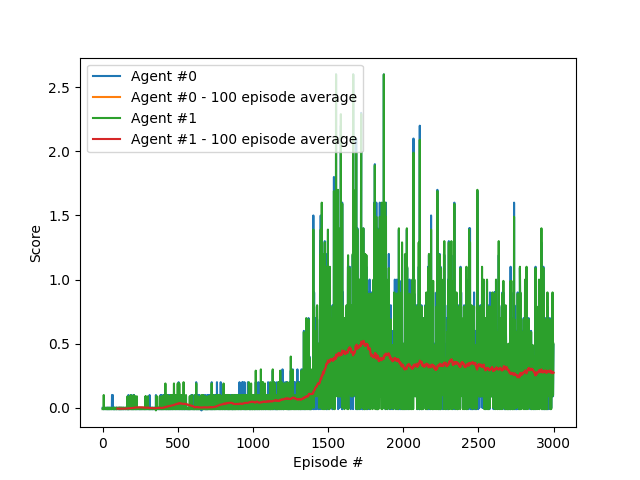

# Continuous Control using DDPG - Project Report

### Implementation

## The Environment

This project is built around the [Reacher](https://github.com/Unity-Technologies/ml-agents/blob/master/docs/Learning-Environment-Examples.md#reacher) environment.


In this environment, a double-jointed arm can move to target locations. A reward of **+0.1** is provided for each step that the agent's hand is in the goal location. Thus, the goal of your agent is to maintain its position at the target location for as many time steps as possible. The environment is considered solved when the agent achieves an average score of at least **30** over **100** episodes. 

We've trained a DDPG agent to solve the single agent (episodic) environment.

### State/observation space

The observation space consists of **33** variables corresponding to position, rotation, velocity, and angular velocities of the arm. 

### Action space

Each action is a vector with four numbers, corresponding to torque applicable to two joints. Every entry in the action vector should be a number between **-1** and **1**.

## Baseline - (random) agent

A random agent was provided to both test the environment and to set the baseline

```python
env_info = env.reset(train_mode=False)[brain_name]     # reset the environment    
states = env_info.vector_observations                  # get the current state (for each agent)
scores = np.zeros(num_agents)                          # initialize the score (for each agent)
while True:
    actions = np.random.randn(num_agents, action_size) # select an action (for each agent)
    actions = np.clip(actions, -1, 1)                  # all actions between -1 and 1
    env_info = env.step(actions)[brain_name]           # send all actions to tne environment
    next_states = env_info.vector_observations         # get next state (for each agent)
    rewards = env_info.rewards                         # get reward (for each agent)
    dones = env_info.local_done                        # see if episode finished
    scores += env_info.rewards                         # update the score (for each agent)
    states = next_states                               # roll over states to next time step
    if np.any(dones):                                  # exit loop if episode finished
        break

print('Total score (averaged over agents) this episode: {}'.format(np.mean(scores)))
```

As expected, the random agent's score averages around ``0``. To achive the **>=30** score, we need something better than a random walk.

## DDPG-agent implementation

The core of the code in this repository is based on the [ddpg-bipedal](https://github.com/udacity/deep-reinforcement-learning/tree/master/ddpg-bipedal) and [ddpg-pendulum](https://github.com/udacity/deep-reinforcement-learning/tree/master/ddpg-pendulum) agents. Some ammendments were made in order to make it work with the Reacher environment.

Deep Deterministic Policy Gradient (DDPG) is a model-free off-policy algorithm for learning continous actions. It combines ideas from DPG (Deterministic Policy Gradient) and DQN (Deep Q-Network). It uses Experience Replay and slow-learning target networks from DQN, and it is based on DPG, which can operate over continuous action spaces. [[ref]](https://keras.io/examples/rl/ddpg_pendulum/)

The DRLND DDPG code was already written to utilize only a single agent, so the required functional changes were minimal. It did however take some trial & error to get the agent to interact with the Reacher environment. The first attemts failed not due to the DDPG algorithm, but due to implementation errors...

### Implementation details

1. Actor network -  [[link]](https://github.com/jbdekker/ddpg-continuous-control/blob/27cb4e9595c02ad36538bb486cdbd831d7e3f4db/src/model.py#L14-L47)

    Multilayer (2-layer) perceptron model (128, 128) with batch normalisation, relu activation for the hidden layers and tanh activation on the output layer (output should be [-1, 1]).

    Experiments showed that a simple model structure worked best. Initially I tried more layers but this resulted in severely reduced training performance (and very unstable ...)

2. Critic network - [[link]](https://github.com/jbdekker/ddpg-continuous-control/blob/27cb4e9595c02ad36538bb486cdbd831d7e3f4db/src/model.py#L50)
    
    Multilayer (2-layer) perceptron model (128, 128) with batch normalisation, relu activation for the hidden layers and tanh activation on the output layer (output should be [-1, 1]).

    Again a limited number of layers to increase training performance & model stability
    
3. Gradient norm clipping [[link]](https://github.com/jbdekker/ddpg-continuous-control/blob/27cb4e9595c02ad36538bb486cdbd831d7e3f4db/src/ddpg_agent.py#L119)

    Clipping proved to be benificial to the training performance of the model

    Without clipping
    

4. Hyperparameters

    A rough manual search of the hyperparameter space was performed. DDPG seemed especially sensitive to learning rate

    Final hyperparameters:

    ```python
        BUFFER_SIZE = int(1e6)  # replay buffer size
        BATCH_SIZE = 256        # minibatch size
        GAMMA = 0.99            # discount factor
        TAU = 1e-3              # for soft update of target parameters
        LR_ACTOR = 1e-4         # learning rate of the actor
        LR_CRITIC = 1e-4        # learning rate of the critic
        WEIGHT_DECAY = 0        # L2 weight decay
        UPDATE_EVERY = 1        # Update every x steps
        UPDATE_N_TIMES = 1      # Update every x steps
    ```

    Note: No extensive grid search was performed to optimize the hyperparameters. A naive manual search (small permutations) showed no significant improvement.

## Results

Final trained agent models:
-   [actor](models/checkpoint_actor.pth), [critic](models/checkpoint_critic.pth)
-   [scores np.save file](models/scores.npy)
-   [scores plot](models/scores.png)

The DDPG with experience replay (uniform sampling), batch normalisation & gradient clipping was able to consistently solve the environment in 150-250 episodes. The agent whose checkpoint is saved in ``models`` was able to solve the environment in 2009 episodes. A plot of the cumulative rewards (score) per training episode is shown below:



Below a video of the agent in action:


## Ideas for future work

1. **Tuning** The hyperparameter choice is somewhat arbitrary as no extensive grid-search was performed. 
2.  **Prioritized experience replay** In uniform sampling (like what we used), all experiances have the same probability of being sampled. This  We can however assume that some experiences are more valuable than others (most experiences in this environment are not that probably not that important). With prioritized experience replay, the sampling distribution is proportional (or at least a function) of some measure of importance. 
3.  **Alternative model architectures** Other architectures can be tested (e.g. A3C, policy gradients) that might improve performance